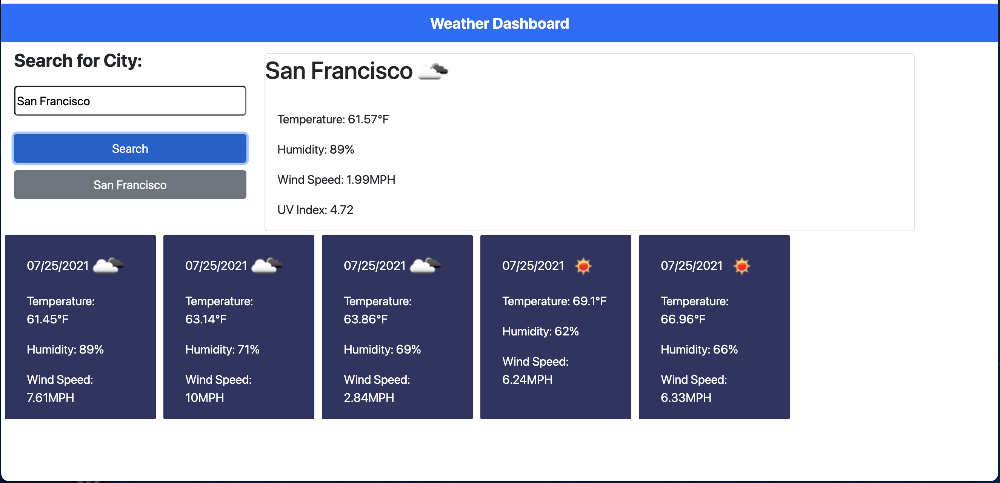

# weather-dashboard

## Table of Contents
* [Description](#description)
* [Installation](#installation)
* [Usage](#usage)
* [Credit](#credit)
* [Contribute](#contribute)

## Description 
This application was built for the user to search the weather conditions in a specific city. When they search the city they will also be presented with a five day forecast of that city as well. While the search history is saved to local storage and can be retrieved by clicking on the button of the recently searched city that is generated, the past results will not display on the page. In the meantime, if the user wishes to view the results of a previously searched city it would be best just to search the city over again. 

## Installation 
1. Clone the <a href="https://github.com/angeeg/weather-dashboard.git">github repo</a> onto your machine in the directory you want to save it in. 
2. Open the repo in your code editor. 
3. Navigate to the index.html --> right click anywhere in the editor --> select "Open in Default Browser" to open on your local machine. 

## Usage 
Use this application to search for weather and get the five day forecast in a city near you... or anywhere!

### Technologies Used:
* Node.js 
* Javascript

## Credit
This project was created by <a href="https://github.com/angeeg">angeeg</a>.

## Contribute 
If you wish to contribute to this application please send a pull request. 
## Questions